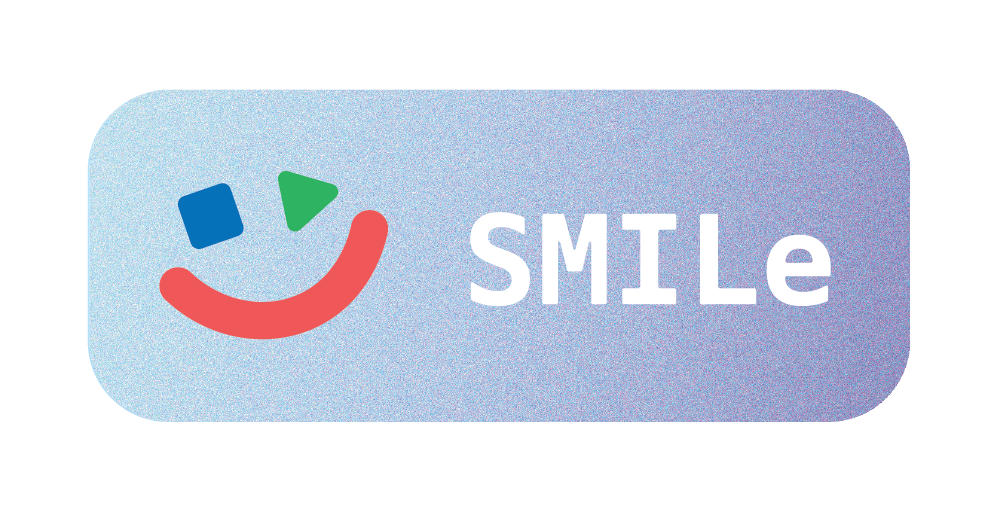

    
    <h1>Scala Media Interactive Learning</h1>

This project is targeted mainly for instructors and students of introductory programming courses. From instructors'
viewpoint, its goal is to provide means to motivate students via contextualized teaching. There are many ways to provide
context, and the approach chosen here is the one of multimedia computation, that is, programmatically creating and
processing multimedia content in a creative way. To provide the necessary scaffolding for novice students already
challenged to learn for example logical and algorithmic thinking, programming concepts and paradigms, a new programming
language (in this case, [Scala](http://www.scala-lang.org/)), and the related development tools, this library offers
ways to concentrate only in the topics to be practiced while still producing hopefully interesting and attractive
results.

This project is the successor of [SMCL.](https://github.com/Aalto-LeTech/Scala-Media-Computation)

## Tools & Dependencies

This library uses [sbt](http://www.scala-sbt.org/) as its build tool.

## Developing with IntelliJ IDEA and SBT

### Building the Library

`sbt packageDoc` generates a jar with the library and its documentation.

Running the `Release` GitHub Action builds the library and publishes it on GitHub.